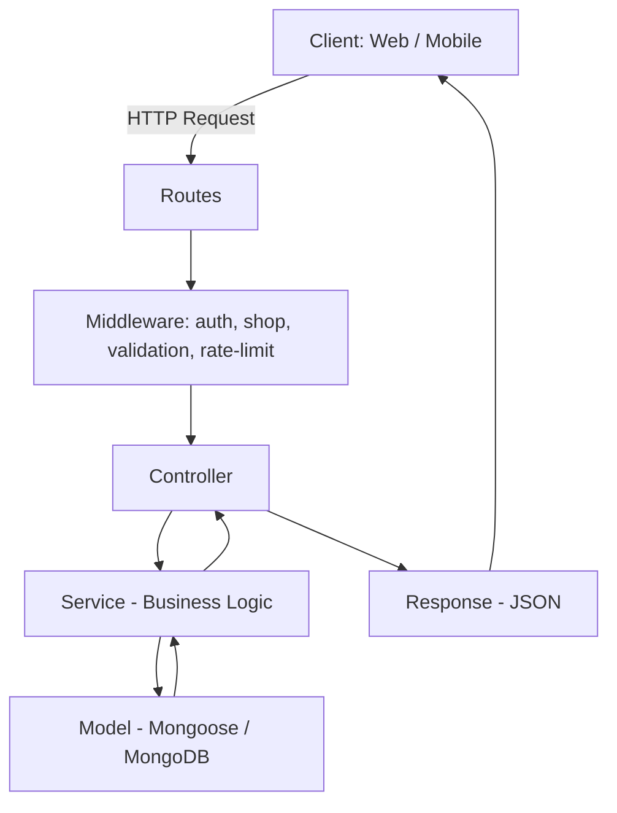
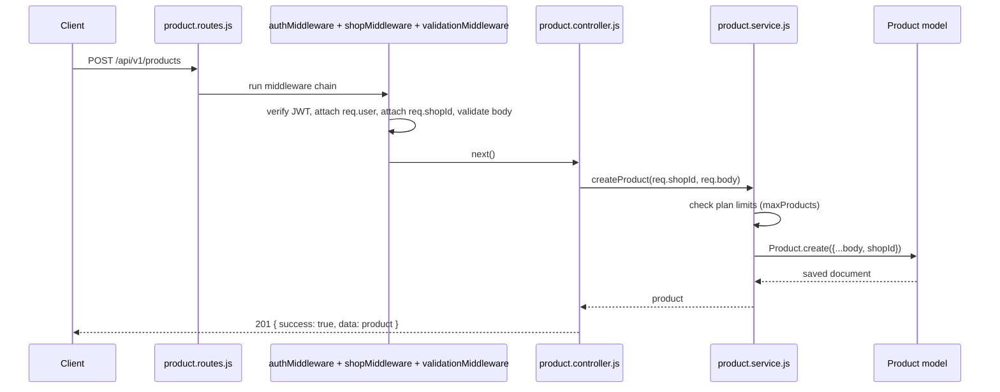
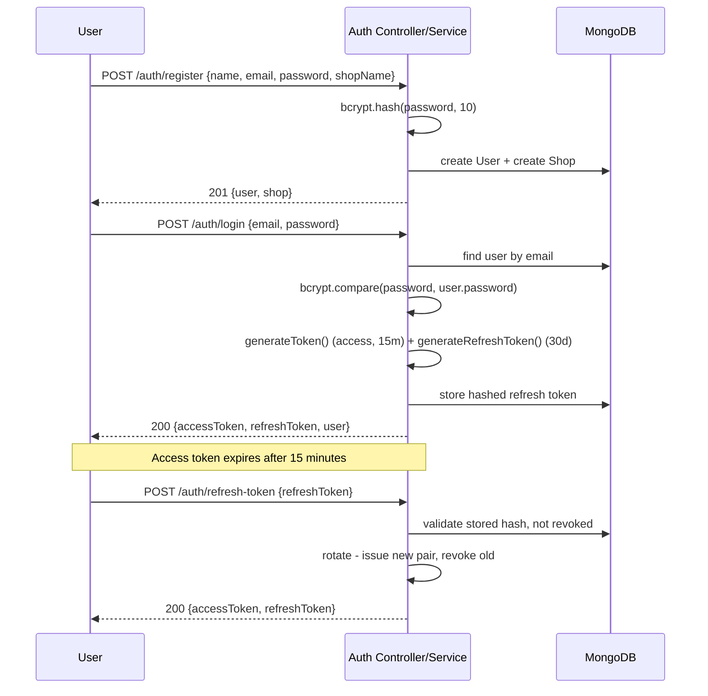
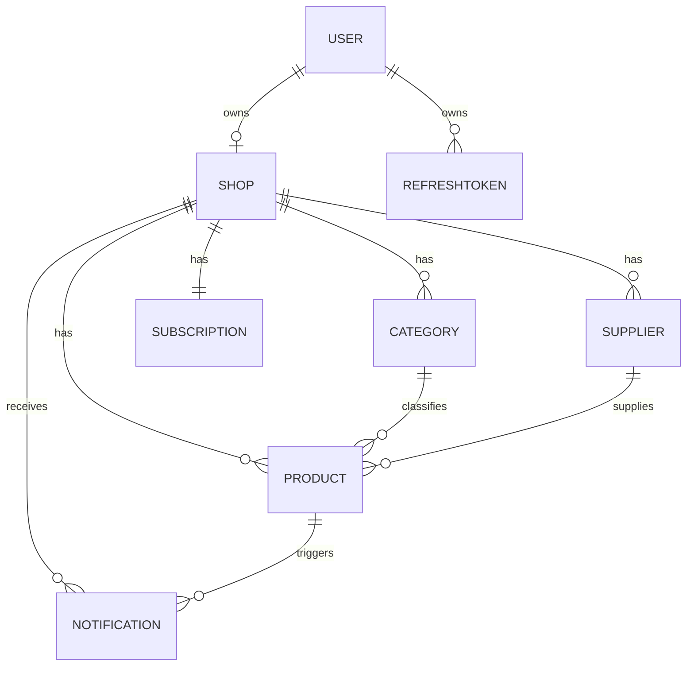
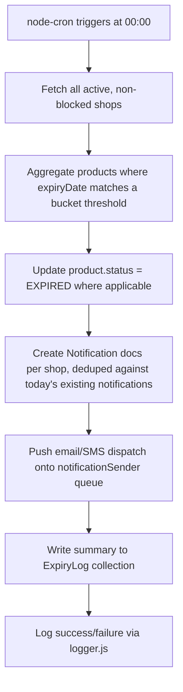

# Dukandar — Backend Architecture & API Documentation

**Smart Inventory & Expiry Management for Every Shop.**

A production-ready MERN backend (Node.js + Express.js, plain JavaScript, MVC architecture) for tracking shop inventory and automatically alerting owners before products expire.

> This document is written so a junior MERN developer can build the entire backend from it without further design decisions. Every module lists its folder placement, data model, API contract, validation rules, and error responses.

---

## Table of Contents

1. [Project Overview](#1-project-overview)
2. [Tech Stack & Why](#2-tech-stack--why)
3. [Folder Structure](#3-folder-structure)
4. [Architecture — MVC + Service Layer](#4-architecture--mvc--service-layer)
5. [Multi-Tenancy Rule](#5-multi-tenancy-rule)
6. [Authentication Module](#6-authentication-module)
7. [Middleware](#7-middleware)
8. [Utils](#8-utils)
9. [Config](#9-config)
10. [Database Models](#10-database-models)
11. [User Module](#11-user-module)
12. [Shop Module](#12-shop-module)
13. [Category Module](#13-category-module)
14. [Supplier Module](#14-supplier-module)
15. [Product Module](#15-product-module)
16. [Expiry Module](#16-expiry-module)
17. [Notification Module](#17-notification-module)
18. [Dashboard Module](#18-dashboard-module)
19. [Reports Module](#19-reports-module)
20. [Upload Module](#20-upload-module)
21. [Security](#21-security)
22. [Best Practices](#22-best-practices)
23. [Build Order (Step-by-Step)](#23-build-order-step-by-step)
24. [Development Roadmap / Future Features](#24-development-roadmap--future-features)

---

## 1. Project Overview

Dukandar lets a shop owner track every product's expiry date and get notified automatically, and lets a Super Admin run the platform as a business (onboarding shops, managing subscriptions, monitoring analytics).

### Roles

| Role | Scope | Can do |
|---|---|---|
| **Super Admin** | Whole platform | Manage all shops, manage users, view analytics/reports, block shops, manage subscriptions |
| **Shop Owner** | Own shop only | Login, manage products/categories/suppliers, receive expiry notifications, view dashboard |

> **Rule:** A Shop Owner must never see or modify another shop's data — enforced at the middleware, service, and model-query level (§5).

---

## 2. Tech Stack & Why

| Technology | Purpose | Why |
|---|---|---|
| **Node.js + Express.js** | HTTP server & routing | Simple, fast to build with, huge ecosystem |
| **JavaScript (ES6+)** | Language | Per project requirement — no TypeScript build step, faster onboarding for junior devs |
| **MongoDB + Mongoose** | Database | Flexible schema fits varied product data; easy to scale horizontally later |
| **JWT + Refresh Token** | Authentication | Stateless access tokens + long-lived refresh tokens for silent re-login |
| **bcrypt** | Password hashing | Industry-standard, slow-by-design hashing resistant to brute force |
| **Multer** | File upload handling | Parses multipart/form-data for images and CSV files |
| **Cloudinary** | Image hosting/CDN | Offloads image storage & optimization from our server |
| **node-cron** | Scheduled jobs | Runs the midnight expiry-check job and other periodic tasks |
| **Redis (Optional)** | Caching / rate-limit store | Speeds up dashboard reads; can be added later without changing the API contract |
| **Swagger** | API docs | Interactive, always-in-sync documentation for frontend/QA |
| **Helmet** | HTTP security headers | Blocks common attacks (clickjacking, MIME sniffing, etc.) |
| **Morgan** | HTTP request logging | Simple dev-friendly request logs, paired with a proper logger in production |
| **express-rate-limit** | Rate limiting | Prevents brute-force/abuse on sensitive routes |
| **dotenv** | Environment variables | Keeps secrets out of source code |

---

## 3. Folder Structure

```
backend/
│
├── src/
│   │
│   ├── config/
│   │   ├── db.js              # MongoDB connection
│   │   ├── cloudinary.js      # Cloudinary SDK config
│   │   ├── env.js             # Centralized process.env access
│   │   ├── swagger.js         # Swagger/OpenAPI setup
│   │   └── redis.js           # Redis client (optional)
│   │
│   ├── controllers/
│   │   ├── auth.controller.js
│   │   ├── user.controller.js
│   │   ├── shop.controller.js
│   │   ├── category.controller.js
│   │   ├── supplier.controller.js
│   │   ├── product.controller.js
│   │   ├── expiry.controller.js
│   │   ├── notification.controller.js
│   │   ├── dashboard.controller.js
│   │   ├── report.controller.js
│   │   └── upload.controller.js
│   │
│   ├── middleware/
│   │   ├── authMiddleware.js
│   │   ├── adminMiddleware.js
│   │   ├── shopMiddleware.js
│   │   ├── errorMiddleware.js
│   │   ├── uploadMiddleware.js
│   │   ├── rateLimiter.js
│   │   └── validationMiddleware.js
│   │
│   ├── models/
│   │   ├── User.js
│   │   ├── Shop.js
│   │   ├── Product.js
│   │   ├── Category.js
│   │   ├── Supplier.js
│   │   ├── Notification.js
│   │   ├── ExpiryLog.js
│   │   ├── Subscription.js
│   │   └── RefreshToken.js
│   │
│   ├── routes/
│   │   ├── auth.routes.js
│   │   ├── user.routes.js
│   │   ├── shop.routes.js
│   │   ├── category.routes.js
│   │   ├── supplier.routes.js
│   │   ├── product.routes.js
│   │   ├── expiry.routes.js
│   │   ├── notification.routes.js
│   │   ├── dashboard.routes.js
│   │   ├── report.routes.js
│   │   ├── upload.routes.js
│   │   └── index.js           # Mounts every router under /api/v1
│   │
│   ├── services/
│   │   ├── auth.service.js
│   │   ├── user.service.js
│   │   ├── shop.service.js
│   │   ├── category.service.js
│   │   ├── supplier.service.js
│   │   ├── product.service.js
│   │   ├── expiry.service.js
│   │   ├── notification.service.js
│   │   ├── dashboard.service.js
│   │   ├── report.service.js
│   │   ├── email.service.js
│   │   └── cloudinary.service.js
│   │
│   ├── jobs/
│   │   ├── expiryChecker.job.js
│   │   ├── notificationSender.job.js
│   │   ├── cleanupNotifications.job.js
│   │   ├── dbBackup.job.js
│   │   └── index.js            # Registers all cron jobs on startup
│   │
│   ├── validators/
│   │   ├── auth.validator.js
│   │   ├── user.validator.js
│   │   ├── shop.validator.js
│   │   ├── category.validator.js
│   │   ├── supplier.validator.js
│   │   ├── product.validator.js
│   │   └── notification.validator.js
│   │
│   ├── utils/
│   │   ├── generateToken.js
│   │   ├── generateRefreshToken.js
│   │   ├── sendResponse.js
│   │   ├── ApiError.js
│   │   ├── ApiResponse.js
│   │   ├── pagination.js
│   │   ├── logger.js
│   │   ├── dateHelper.js
│   │   └── barcodeGenerator.js
│   │
│   ├── uploads/                # Temp local storage before Cloudinary push (Multer disk buffer)
│   │
│   ├── app.js                  # Express app: middleware wiring, route mounting
│   └── server.js               # HTTP server bootstrap, DB/Redis connect, cron start, graceful shutdown
│
├── .env.example
├── .eslintrc.json
├── package.json
└── README.md
```

### Purpose of every folder

| Folder | Purpose |
|---|---|
| `config/` | All external-connection setup (DB, Cloudinary, Swagger, Redis) and environment loading — one place to change infrastructure config |
| `controllers/` | Receives `req`/`res`, calls the matching service, sends the HTTP response. Contains **no business logic** |
| `middleware/` | Cross-cutting request processing shared by many routes (auth checks, error handling, uploads, rate limiting) |
| `models/` | Mongoose schemas — the single source of truth for what a document looks like, its validation, and its indexes |
| `routes/` | Maps HTTP method + path → middleware chain → controller. No logic beyond wiring |
| `services/` | All business logic lives here (e.g., "does this shop's plan allow one more product?"). Controllers call services; services call models |
| `jobs/` | Scheduled/background tasks (cron), isolated from the request/response cycle so they can be tested and reasoned about independently |
| `validators/` | Request-shape validation rules (using a schema library or manual checks) consumed by `validationMiddleware` |
| `utils/` | Small, reusable, dependency-light helper functions used across the app |
| `uploads/` | Local scratch space Multer writes to before a file is forwarded to Cloudinary or parsed (CSV) — never a permanent store |

---

## 4. Architecture — MVC + Service Layer

Dukandar uses classic **MVC** (Model–View–Controller, with "View" replaced by JSON responses since this is an API-only backend), plus a **Service layer** between Controller and Model to keep business logic out of both HTTP handling and database schemas.

### 4.1 Request Flow



### 4.2 Layer Responsibilities

| Layer | Responsibility | Never does |
|---|---|---|
| **Routes** | Wire `METHOD + path` to a middleware chain + controller | Contains no logic |
| **Middleware** | Auth check, tenant/shop check, request validation, rate limiting, error catching | Doesn't talk to the database directly (except auth token lookups) |
| **Controller** | Parses `req`, calls one service method, shapes the `res.json()` output | Never queries Mongoose models directly; never contains `if (plan.maxProducts...)`-style business rules |
| **Service** | All business rules: plan limits, tenant scoping, expiry classification, notification creation | Never touches `req`/`res` directly — services take plain arguments and return plain data, so they're usable from controllers *and* cron jobs |
| **Model** | Schema shape, field validation, indexes, Mongoose hooks (e.g., pre-save hashing) | Never contains cross-collection business rules |

### 4.3 Example Flow — Creating a Product



---

## 5. Multi-Tenancy Rule

Dukandar uses a **shared database, shared schema** multi-tenancy model: every tenant-owned collection (`Product`, `Category`, `Supplier`, `Notification`) has a required, indexed `shopId` field.

**How it's enforced:**

1. `authMiddleware` verifies the JWT and attaches `req.user = { id, role, shopId }`.
2. `shopMiddleware` reads `req.user.shopId` (never from the request body or query string) and attaches `req.shopId`. It also blocks the request with `403` if the shop is blocked.
3. Every service function that touches a tenant-owned collection **requires** `shopId` as its first argument — there is no code path to query products/categories/suppliers without it.
4. Compound indexes always start with `shopId` (e.g., `{ shopId: 1, expiryDate: 1 }`) so per-tenant queries stay fast even with millions of documents platform-wide.
5. Super Admin routes use `adminMiddleware` instead of `shopMiddleware` and intentionally bypass the shop filter — every such action is written to an audit trail.

---

## 6. Authentication Module

### 6.1 Authentication Flow



### 6.2 JWT

- **Access token**: signed with `JWT_SECRET`, expires in **15 minutes**, payload `{ id, role, shopId }`.
- **Refresh token**: signed with `JWT_REFRESH_SECRET`, expires in **30 days**, payload `{ id, tokenId }`. Stored **hashed** (not raw) in the `RefreshToken` collection so a database leak doesn't expose usable tokens.
- Access tokens are verified on every request using only the signature + expiry (no DB call) — this is what makes them fast and stateless.

### 6.3 Refresh Token Rotation

Every time `/auth/refresh-token` is called, the old refresh token is marked `isRevoked: true` and a brand-new one is issued. If a revoked token is presented again, all refresh tokens for that user are revoked immediately (protects against stolen-token replay).

### 6.4 Password Hashing

`bcrypt` with **10 salt rounds**, applied in a Mongoose `pre('save')` hook on the `User` model so it's impossible to forget to hash a password before saving. Password field uses `select: false` so it is never returned by default in queries.

### 6.5 API Reference

| Method | Endpoint | Purpose | Auth Required | Role |
|---|---|---|---|---|
| POST | `/api/v1/auth/register` | Register a new shop owner (creates User + Shop) | No | — |
| POST | `/api/v1/auth/login` | Login, returns access + refresh tokens | No | — |
| POST | `/api/v1/auth/logout` | Revokes current refresh token | Yes | Any |
| POST | `/api/v1/auth/refresh-token` | Rotates and returns a new token pair | No (refresh token required) | — |
| POST | `/api/v1/auth/forgot-password` | Emails a password-reset link/token | No | — |
| POST | `/api/v1/auth/reset-password` | Resets password using the emailed token | No | — |
| GET | `/api/v1/auth/profile` | Returns the logged-in user's profile | Yes | Any |

#### POST `/auth/register`

**Request Body**
```json
{
  "name": "Ramesh Kumar",
  "email": "ramesh@shop.com",
  "password": "StrongPass@123",
  "shopName": "Ramesh General Store",
  "phone": "9876543210"
}
```

**Validation Rules**
- `name`: string, 2–50 chars, required
- `email`: valid email format, unique, required
- `password`: min 8 chars, at least one uppercase letter, one number, one special character
- `shopName`: string, 2–100 chars, required
- `phone`: exactly 10 digits, unique

**Success Response `201`**
```json
{ "success": true, "message": "Registered successfully", "data": { "user": { "id": "665f...", "name": "Ramesh Kumar", "role": "SHOP_OWNER" }, "shop": { "id": "665f...", "name": "Ramesh General Store" } } }
```

**Error Response `409`**
```json
{ "success": false, "message": "Email already registered" }
```

**Status Codes:** `201 Created` · `400 Validation Error` · `409 Email/Phone already exists`

#### POST `/auth/login`

**Request Body:** `{ "email": "string", "password": "string" }`

**Success Response `200`**
```json
{ "success": true, "data": { "accessToken": "...", "refreshToken": "...", "user": { "id": "665f...", "role": "SHOP_OWNER", "shopId": "665f..." } } }
```

**Status Codes:** `200 OK` · `400 Validation Error` · `401 Invalid credentials` · `403 Account blocked`

#### POST `/auth/logout`
Revokes the refresh token tied to the current session. **Response `200`:** `{ "success": true, "message": "Logged out" }`

#### POST `/auth/refresh-token`
**Body:** `{ "refreshToken": "string" }` → **Response `200`:** new `{ accessToken, refreshToken }` · **Errors:** `401 Invalid, expired, or reused token`

#### POST `/auth/forgot-password`
**Body:** `{ "email": "string" }` → always returns a generic `200` message (never reveals whether the email exists)

#### POST `/auth/reset-password`
**Body:** `{ "token": "string", "newPassword": "string" }` → **Errors:** `400 Invalid or expired token`

#### GET `/auth/profile`
**Response `200`:** current user object, password field excluded

---

## 7. Middleware

| File | Purpose |
|---|---|
| `authMiddleware.js` | Extracts the Bearer token, verifies its signature/expiry, attaches `req.user` |
| `adminMiddleware.js` | Runs after `authMiddleware`; rejects with `403` if `req.user.role !== 'SUPER_ADMIN'` |
| `shopMiddleware.js` | Runs after `authMiddleware`; attaches `req.shopId = req.user.shopId`, rejects with `403` if the shop is blocked |
| `errorMiddleware.js` | Centralized error handler — the **last** middleware in `app.js`; catches everything thrown via `ApiError` or unexpected exceptions, logs it, and sends a consistent JSON error shape |
| `uploadMiddleware.js` | Configures Multer (file type whitelist, size limits) for image and CSV uploads |
| `rateLimiter.js` | `express-rate-limit` config — strict on `/auth/*` (e.g., 5 requests/min), looser on general API routes |
| `validationMiddleware.js` | Generic wrapper that runs a given validator schema against `req.body`/`req.query`/`req.params` and returns `400` with field errors on failure |

### Error Response Shape (from `errorMiddleware.js`)

```json
{
  "success": false,
  "message": "Email already in use",
  "errors": [ { "field": "email", "message": "Email already in use" } ]
}
```

---

## 8. Utils

| File | Why it exists |
|---|---|
| `generateToken.js` | One place to sign access tokens with the correct secret/expiry/payload shape — avoids copy-pasted `jwt.sign()` calls |
| `generateRefreshToken.js` | Same, for refresh tokens — kept separate since it has a different secret, expiry, and storage step |
| `sendResponse.js` | Wraps `res.json()` in the standard `{ success, message, data }` envelope so every controller returns identically-shaped responses |
| `ApiError.js` | A custom `Error` subclass carrying an HTTP status code + optional field errors, thrown from services and caught by `errorMiddleware` |
| `ApiResponse.js` | Standard success-response class, paired with `ApiError` for a consistent "throw errors, return responses" pattern |
| `pagination.js` | Parses/sanitizes `page`/`limit`/`sort` query params and builds the Mongoose `.skip()/.limit()/.sort()` options plus a `meta` object |
| `logger.js` | A single configured logger instance (e.g., Winston) so every file logs in the same format instead of using raw `console.log` |
| `dateHelper.js` | Date math for the expiry engine — "days until expiry", timezone-aware "today", date range builders |
| `barcodeGenerator.js` | Generates a unique barcode/SKU when a shop owner doesn't supply one manually |

---

## 9. Config

| File | Explanation |
|---|---|
| `db.js` | Connects to MongoDB via Mongoose (`mongoose.connect(process.env.MONGO_URI)`), logs connection success/failure, exits process on failure to connect at startup |
| `cloudinary.js` | Configures the Cloudinary SDK with `cloud_name`, `api_key`, `api_secret` from environment variables |
| `env.js` | Loads and validates required environment variables once at startup (fails fast with a clear error if something critical is missing, instead of crashing deep inside a request handler later) |
| `swagger.js` | Sets up `swagger-jsdoc` + `swagger-ui-express`, serving interactive API docs at `/api-docs` |
| `redis.js` | Creates and exports a Redis client (optional — the app must work correctly with Redis absent, falling back to no caching) |

---

## 10. Database Models

All models use Mongoose `timestamps: true` (`createdAt`/`updatedAt`) and soft-delete (`isDeleted: Boolean`, default `false`) for tenant business data.

### 10.1 `User`

| Field | Type | Notes |
|---|---|---|
| name | String | required |
| email | String | required, unique, lowercase, indexed |
| password | String | required, `select: false`, bcrypt-hashed via `pre('save')` hook |
| phone | String | unique, indexed |
| role | String enum | `SUPER_ADMIN`, `SHOP_OWNER` |
| shopId | ObjectId ref `Shop` | required for `SHOP_OWNER` |
| isBlocked | Boolean | default `false` |
| isEmailVerified | Boolean | default `false` |

**Indexes:** `{ email: 1 }` unique · `{ phone: 1 }` unique
**Relationships:** one `User` (SHOP_OWNER) → one `Shop`

### 10.2 `Shop`

| Field | Type | Notes |
|---|---|---|
| name | String | required |
| ownerId | ObjectId ref `User` | required, unique |
| logoUrl | String | Cloudinary URL |
| address | String | |
| gstNumber | String | optional |
| isBlocked | Boolean | default `false` |
| subscriptionId | ObjectId ref `Subscription` | |

**Indexes:** `{ ownerId: 1 }` unique
**Relationships:** one `Shop` → many `Product`/`Category`/`Supplier`/`Notification`

### 10.3 `Category`

| Field | Type | Notes |
|---|---|---|
| shopId | ObjectId ref `Shop` | required, indexed |
| name | String | required |
| description | String | optional |

**Indexes:** `{ shopId: 1, name: 1 }` unique compound

### 10.4 `Supplier`

| Field | Type | Notes |
|---|---|---|
| shopId | ObjectId ref `Shop` | required, indexed |
| name | String | required |
| contactPerson | String | |
| phone | String | |
| email | String | |

**Indexes:** `{ shopId: 1, name: 1 }`

### 10.5 `Product`

| Field | Type | Notes |
|---|---|---|
| shopId | ObjectId ref `Shop` | required, indexed |
| name | String | required |
| brand | String | |
| barcode | String | indexed, unique per shop |
| sku | String | indexed |
| categoryId | ObjectId ref `Category` | |
| supplierId | ObjectId ref `Supplier` | |
| batchNumber | String | |
| manufactureDate | Date | |
| expiryDate | Date | required, indexed |
| purchasePrice | Number | min 0 |
| sellingPrice | Number | min 0 |
| quantity | Number | min 0 |
| currentStock | Number | min 0 |
| minimumStock | Number | min 0, default 5 |
| imageUrl | String | Cloudinary URL |
| status | String enum | `ACTIVE, EXPIRED, OUT_OF_STOCK, DISCONTINUED` |
| notes | String | |

**Indexes:**
- `{ shopId: 1, expiryDate: 1 }` — powers the nightly expiry scan
- `{ shopId: 1, barcode: 1 }` unique — fast barcode lookup, no duplicates per shop
- `{ shopId: 1, name: "text", brand: "text" }` — search
- `{ shopId: 1, categoryId: 1 }` / `{ shopId: 1, supplierId: 1 }` — filtering

### 10.6 `Notification`

| Field | Type | Notes |
|---|---|---|
| shopId | ObjectId ref `Shop` | required, indexed |
| userId | ObjectId ref `User` | recipient |
| type | String enum | `EXPIRY_ALERT, LOW_STOCK, SYSTEM, ANNOUNCEMENT` |
| title | String | |
| message | String | |
| relatedProductId | ObjectId ref `Product` | optional |
| isRead | Boolean | default `false` |
| isArchived | Boolean | default `false` |

**Indexes:** `{ shopId: 1, isRead: 1, createdAt: -1 }`

### 10.7 `ExpiryLog`

| Field | Type | Notes |
|---|---|---|
| runDate | Date | indexed |
| shopsScanned | Number | |
| productsFlagged | Number | |
| notificationsCreated | Number | |
| status | String enum | `SUCCESS, PARTIAL, FAILED` |

### 10.8 `Subscription`

| Field | Type | Notes |
|---|---|---|
| shopId | ObjectId ref `Shop` | required, unique, indexed |
| plan | String enum | `FREE, PREMIUM, BUSINESS` |
| status | String enum | `TRIAL, ACTIVE, EXPIRED, CANCELLED` |
| startDate | Date | |
| endDate | Date | indexed |

### 10.9 `RefreshToken`

| Field | Type | Notes |
|---|---|---|
| userId | ObjectId ref `User` | indexed |
| tokenHash | String | SHA-256 hash, never store raw token |
| isRevoked | Boolean | default `false` |
| expiresAt | Date | TTL index — MongoDB auto-deletes expired docs |

### 10.10 Entity Relationship Diagram



---

## 11. User Module

*(Super Admin only)*

| Method | Endpoint | Purpose | Auth | Role |
|---|---|---|---|---|
| GET | `/api/v1/users` | List users (paginated, filter by role) | Yes | SUPER_ADMIN |
| GET | `/api/v1/users/:id` | Get single user | Yes | SUPER_ADMIN |
| PATCH | `/api/v1/users/:id` | Update a user's details | Yes | SUPER_ADMIN |
| DELETE | `/api/v1/users/:id` | Soft-delete a user | Yes | SUPER_ADMIN |
| PATCH | `/api/v1/users/block` | Block a user (`{ userId }` in body) | Yes | SUPER_ADMIN |
| PATCH | `/api/v1/users/unblock` | Unblock a user (`{ userId }` in body) | Yes | SUPER_ADMIN |

**Validation:** `role`, if updated, must be `SUPER_ADMIN` or `SHOP_OWNER`.
**Errors:** `404 User not found` · `403 Cannot block your own account` · `409 Cannot delete a user with an active paid subscription`

---

## 12. Shop Module

| Method | Endpoint | Purpose | Auth | Role |
|---|---|---|---|---|
| POST | `/api/v1/shops` | Create a shop (normally done during registration; also usable by admin) | Yes | SUPER_ADMIN |
| GET | `/api/v1/shops` | List all shops (paginated, filter by status) | Yes | SUPER_ADMIN |
| GET | `/api/v1/shops/:id` | Get a shop's profile | Yes | SUPER_ADMIN or owning SHOP_OWNER |
| PATCH | `/api/v1/shops/:id` | Update shop profile | Yes | Owning SHOP_OWNER |
| DELETE | `/api/v1/shops/:id` | Soft-delete a shop | Yes | SUPER_ADMIN |

**Request Body — PATCH `/shops/:id`**
```json
{ "name": "Ramesh General Store", "address": "MG Road, Digha", "gstNumber": "22ABCDE1234F1Z5" }
```

**Validation:** `name` 2–100 chars; `gstNumber` matches GSTIN format if provided.
**Errors:** `403 Not your shop` · `403 Shop is blocked`

---

## 13. Category Module

| Method | Endpoint | Purpose |
|---|---|---|
| POST | `/api/v1/categories` | Create category |
| GET | `/api/v1/categories` | List categories (`?search=milk&page=1&limit=20`) |
| GET | `/api/v1/categories/:id` | Get single category |
| PATCH | `/api/v1/categories/:id` | Update category |
| DELETE | `/api/v1/categories/:id` | Soft-delete category |

**Request Body — POST:** `{ "name": "Dairy", "description": "Milk, curd, cheese, paneer" }`
**Validation:** `name` required, 2–50 chars, unique per shop (case-insensitive).
**Errors:** `409 Category name already exists in this shop` · `409 Cannot delete a category with active products`

---

## 14. Supplier Module

| Method | Endpoint | Purpose |
|---|---|---|
| POST | `/api/v1/suppliers` | Create supplier |
| GET | `/api/v1/suppliers` | List suppliers (paginated, searchable) |
| GET | `/api/v1/suppliers/:id` | Get single supplier |
| PATCH | `/api/v1/suppliers/:id` | Update supplier |
| DELETE | `/api/v1/suppliers/:id` | Soft-delete supplier |

**Request Body — POST:** `{ "name": "Amul", "contactPerson": "Distributor Rep", "phone": "9123456780", "email": "amul@dist.com" }`
**Validation:** `name` required; `phone` 10 digits if present; `email` valid format if present.
**Errors:** `409 Cannot delete a supplier linked to active products`

---

## 15. Product Module

| Method | Endpoint | Purpose |
|---|---|---|
| POST | `/api/v1/products` | Create product |
| GET | `/api/v1/products` | List products — paginated, filterable, sortable, searchable |
| GET | `/api/v1/products/:id` | Get product details |
| PATCH | `/api/v1/products/:id` | Update product |
| DELETE | `/api/v1/products/:id` | Soft-delete product |
| PATCH | `/api/v1/products/:id/stock` | Adjust current stock (`{ change: -5 }` or `{ set: 20 }`) |
| POST | `/api/v1/products/import` | Bulk import via CSV (multipart) |
| GET | `/api/v1/products/export` | Export current product list as CSV |
| GET | `/api/v1/products/barcode/:barcode` | Exact barcode lookup |

### Request Body — POST `/products`
```json
{
  "name": "Amul Toned Milk 500ml",
  "brand": "Amul",
  "barcode": "8901234567890",
  "sku": "MILK-AMUL-500",
  "categoryId": "665f...",
  "supplierId": "665f...",
  "batchNumber": "B2026-07",
  "manufactureDate": "2026-07-01",
  "expiryDate": "2026-07-15",
  "purchasePrice": 24,
  "sellingPrice": 28,
  "quantity": 100,
  "currentStock": 100,
  "minimumStock": 10,
  "notes": "Keep refrigerated"
}
```

### Validation Rules
- `name`, `expiryDate` required
- `expiryDate` must be a valid date, today or in the future at creation time
- `manufactureDate`, if given, must be before `expiryDate`
- `purchasePrice`, `sellingPrice`, `quantity`, `currentStock`, `minimumStock` ≥ 0
- `categoryId`/`supplierId`, if provided, must belong to the same shop (`400` if not)
- `barcode`, if provided, must be unique within the shop

### Query Parameters — GET `/products`

| Param | Example | Purpose |
|---|---|---|
| `page`, `limit` | `?page=2&limit=20` | Pagination |
| `sort` | `?sort=-expiryDate` | Sort field, `-` = descending |
| `categoryId` | `?categoryId=665f...` | Filter by category |
| `supplierId` | `?supplierId=665f...` | Filter by supplier |
| `status` | `?status=EXPIRED` | Filter by status |
| `expiringInDays` | `?expiringInDays=7` | Products expiring within N days |
| `search` | `?search=milk` | Text search on name/brand/SKU |

### Success Response `200` (list)
```json
{
  "success": true,
  "data": {
    "items": [ { "id": "665f...", "name": "Amul Toned Milk 500ml", "expiryDate": "2026-07-15", "currentStock": 100 } ],
    "pagination": { "page": 1, "limit": 20, "total": 358, "totalPages": 18 }
  }
}
```

**Status Codes:** `200 OK` · `201 Created` · `400 Validation Error` · `404 Not found` · `409 Duplicate barcode/SKU` · `403 Product limit reached for current plan`

### PATCH `/products/:id/stock`
**Body (one of):** `{ "change": -5 }` (relative adjustment, e.g., after a sale) or `{ "set": 20 }` (absolute set, e.g., after a stock count).
**Validation:** resulting `currentStock` cannot go below 0 (`400`).
**Response `200`:** updated product with new `currentStock` and recalculated `status` (e.g., flips to `OUT_OF_STOCK` at 0).

### POST `/products/import` (CSV bulk import)

1. Multer receives the file to memory (max 10MB).
2. Stream-parse CSV rows.
3. Validate every row against the same product validator; collect row-level errors instead of aborting the whole batch.
4. `insertMany({ ordered: false })` so valid rows still get inserted even if some rows fail.
5. Return a summary: `{ "inserted": 240, "failed": 12, "errors": [{ "row": 5, "message": "expiryDate is required" }] }`.

### Indexing, Pagination, Search, Filtering, Sorting

- **Indexes:** `{shopId:1, expiryDate:1}`, `{shopId:1, barcode:1}` unique, `{shopId:1, name:"text", brand:"text"}`, `{shopId:1, categoryId:1}`, `{shopId:1, supplierId:1}`, `{shopId:1, status:1}`.
- **Pagination:** offset-based (`page`/`limit`, capped at 100 per page) via `utils/pagination.js`.
- **Search:** MongoDB text index for free-text (`name`, `brand`); exact-match indexed lookups for `barcode`/`sku` (never regex scans on large collections).
- **Sorting:** always paired with an index covering the sort field to avoid slow in-memory sorts.
- **Filtering:** combinable query params (`categoryId` + `status` + `expiringInDays`) are all built into a single Mongoose `find()` filter object, so filters compose without extra round trips.

---

## 16. Expiry Module

### 16.1 Classification Buckets

| Bucket | Condition |
|---|---|
| Expired | `expiryDate < today` |
| Today Expiry | `expiryDate == today` |
| Tomorrow Expiry | `expiryDate == today + 1` |
| 7 Days Remaining | `expiryDate == today + 7` |
| 15 Days Remaining | `expiryDate == today + 15` |
| 30 Days Remaining | `expiryDate == today + 30` |

### 16.2 Cron Job Flow (`jobs/expiryChecker.job.js`, runs daily at 00:00)



**Database query (conceptual, using `dateHelper.js` to compute thresholds):**
```js
Product.aggregate([
  { $match: { isDeleted: false, expiryDate: { $lte: maxThresholdDate } } },
  { $addFields: { daysUntilExpiry: { $dateDiff: { startDate: "$$NOW", endDate: "$expiryDate", unit: "day" } } } },
  { $match: { daysUntilExpiry: { $in: [0, 1, 7, 15, 30] } } },
  { $group: { _id: "$shopId", products: { $push: "$$ROOT" } } }
]);
```

### 16.3 Notification Creation & Deduplication

Before inserting, the job checks whether a notification for the same `(shopId, productId, bucketLabel, date)` already exists today, preventing duplicates if the job is retried after a crash. Inserts are batched (`insertMany`, 1,000 docs at a time) to bound memory.

### 16.4 Optimization Notes

- The `{shopId:1, expiryDate:1}` compound index means this aggregation never does a full collection scan, even with millions of products.
- Email/SMS dispatch happens in a **separate** cron (`notificationSender.job.js`, every 5 minutes) so a slow email provider never blocks expiry classification.
- The whole job is idempotent — safe to re-run after a crash because of the deduplication check.

### 16.5 API

| Method | Endpoint | Purpose |
|---|---|---|
| GET | `/api/v1/expiry/summary` | Get counts per bucket for the shop (used by dashboard) |
| GET | `/api/v1/expiry/products?bucket=EXPIRED` | List products in a specific bucket |

---

## 17. Notification Module

| Method | Endpoint | Purpose |
|---|---|---|
| GET | `/api/v1/notifications` | List notifications (`?isRead=false&type=EXPIRY_ALERT`) |
| PATCH | `/api/v1/notifications/:id/read` | Mark one as read |
| DELETE | `/api/v1/notifications/:id` | Delete a notification |

**Additionally supported via query params:** `?isRead=true|false` (read/unread filter), `?isArchived=true` (archived view). Archiving itself uses `PATCH /api/v1/notifications/:id` with `{ "isArchived": true }`.
**Types:** `EXPIRY_ALERT`, `LOW_STOCK`, `SYSTEM`, `ANNOUNCEMENT`.
**Errors:** `404 Notification not found or not owned by this shop`

---

## 18. Dashboard Module

### Shop Dashboard — `GET /api/v1/dashboard`
```json
{
  "totalProducts": 358,
  "expiredProducts": 5,
  "expiringSoon": 16,
  "lowStock": 9,
  "categories": 12,
  "suppliers": 8
}
```
Computed with a single Mongoose aggregation using `$facet` (one DB round trip returns every count).

### Admin Dashboard — `GET /api/v1/admin/dashboard`
```json
{
  "totalShops": 12500,
  "totalUsers": 12500,
  "totalProducts": 4300000,
  "revenue": 850000,
  "reports": { "newShopsThisMonth": 340, "activeSubscriptions": 4500 }
}
```

---

## 19. Reports Module

| Method | Endpoint | Purpose |
|---|---|---|
| GET | `/api/v1/reports/expiry?format=csv` | Expiry report (all buckets) |
| GET | `/api/v1/reports/inventory?format=xlsx` | Full inventory snapshot |
| GET | `/api/v1/reports/category?format=csv` | Per-category breakdown |
| GET | `/api/v1/reports/supplier?format=pdf` | Per-supplier breakdown |

`format` supports `csv` (streamed directly), `xlsx` (via `exceljs`), `pdf` (via `pdfkit`). Large reports are generated by a background job; the API responds `202 Accepted` with a `jobId` for large shops rather than blocking the request, and the client polls `GET /api/v1/reports/:jobId/status` for the download URL.

**Errors:** `400 Unsupported format`

---

## 20. Upload Module

| Method | Endpoint | Purpose |
|---|---|---|
| POST | `/api/v1/uploads/image` | Generic image upload → Cloudinary URL |
| POST | `/api/v1/uploads/csv` | CSV upload for bulk import (delegates to Product module) |

**Flow:** `uploadMiddleware.js` (Multer) receives the file → validates type/size → for images, streams to Cloudinary via `cloudinary.service.js` and returns the secure URL; for CSV, hands the buffer to the Product import service.
**Validation:** images limited to `jpg/png/webp`, max 5MB; CSV limited to 10MB and a max row count (e.g., 20,000 rows).
**Errors:** `413 File too large` · `415 Unsupported file type`

---

## 21. Security

| Concern | Mitigation |
|---|---|
| **JWT** | Short-lived (15m) access tokens signed with a strong secret; payload carries only `id`, `role`, `shopId` |
| **bcrypt** | 10 salt rounds, applied in a model hook, password field excluded from queries by default |
| **Helmet** | Sets secure headers (CSP, `X-Frame-Options`, HSTS, etc.) on every response |
| **Rate Limiting** | `express-rate-limit`, strict on `/auth/*` (e.g., 5/min), looser elsewhere |
| **CORS** | Explicit origin allow-list; credentials only permitted for whitelisted frontend domains |
| **Input Validation** | Every mutating endpoint validated through `validators/` + `validationMiddleware.js`; unknown fields rejected |
| **Environment Variables** | All secrets in `.env` (never committed); `.env.example` documents every required key |
| **Secure Cookies** | Refresh tokens, if stored in a cookie, use `HttpOnly`, `Secure`, `SameSite=Strict` |

---

## 22. Best Practices

- **MVC Architecture** — Routes → Middleware → Controller → Service → Model, each layer with one job (§4).
- **REST API Standards** — plural resource nouns (`/products`), correct HTTP verbs, consistent response envelope, versioned base path (`/api/v1`).
- **Clean Code** — small functions, descriptive names, no deeply nested conditionals in controllers.
- **DRY** — shared logic (pagination, response shaping, error formatting) centralized in `utils/`.
- **SOLID (where applicable)** — e.g., Single Responsibility: controllers only translate HTTP ↔ service calls; services hold all business rules.
- **Proper Error Handling** — every service throws `ApiError`; every controller wraps its async logic so errors reach `errorMiddleware.js` (see next point).
- **Async/Await** — no callback pyramids; every controller/service function is `async` and awaited consistently.
- **Centralized Response Format** — every success response is `{ success: true, message, data }`; every error is `{ success: false, message, errors }`.
- **Global Error Handler** — `errorMiddleware.js` is the single place that turns any thrown error into an HTTP response; controllers never write ad-hoc `try/catch` → `res.status(500)` blocks.
- **Consistent Naming Conventions** — `camelCase` for variables/functions, `PascalCase` for Mongoose models/classes, `kebab-case` or `camelCase.suffix.js` for file names (e.g., `product.controller.js`), `UPPER_SNAKE_CASE` for enum-like constants.

---

## 23. Build Order (Step-by-Step)

Build in this order — each step is usable/testable before moving to the next:

1. **Project setup** — `package.json`, `.env.example`, `config/env.js`, `config/db.js`, basic `app.js`/`server.js` with a health-check route.
2. **User + Shop models** — schemas, indexes, validation.
3. **Auth module** — register, login, JWT + refresh token generation, `authMiddleware.js`.
4. **Shop module** — profile CRUD, `shopMiddleware.js` for tenant scoping.
5. **Category & Supplier modules** — simplest CRUD, good place to establish the Controller→Service→Model pattern.
6. **Product module** — the core feature; add indexes early, then CRUD, then stock adjustment, then search/filter/pagination.
7. **Upload module** — Cloudinary image upload wired into Product's image field; CSV import/export.
8. **Expiry module + cron job** — classification logic, `expiryChecker.job.js`, `ExpiryLog` model.
9. **Notification module** — model, list/read/delete APIs, wire notification creation into the expiry job.
10. **Dashboard module** — shop + admin aggregate endpoints.
11. **Reports module** — CSV first (simplest), then Excel, then PDF; move to background job once exports get slow.
12. **User module (Super Admin)** — user management, block/unblock.
13. **Security hardening** — Helmet, rate limiting, CORS lockdown, input sanitization review.
14. **Swagger docs** — annotate routes, serve `/api-docs`.
15. **Testing & deployment prep** — write integration tests for auth + product flows, Dockerize, set up CI.

---

## 24. Development Roadmap / Future Features

| Feature | Description |
|---|---|
| **Barcode Scanner** | Mobile camera-based barcode scanning to speed up product entry |
| **OCR Scanner** | Photograph a product label to auto-fill name/brand/expiry |
| **AI Expiry Prediction** | Predict likely wastage from sales velocity + historical expiry patterns |
| **WhatsApp Notifications** | Expiry alerts and quick commands via WhatsApp Business API |
| **SMS Alerts** | Fallback channel for shops with poor connectivity |
| **Mobile App** | Native iOS/Android clients consuming this same API |
| **GST Billing** | Generate GST-compliant invoices |
| **POS System** | Sync stock automatically as sales happen at a connected terminal |
| **Employee Management** | Sub-accounts with restricted permissions per staff member |
| **Multi-Branch Shops** | One owner managing several linked shop branches |
| **Purchase Orders** | Formal PO creation/tracking workflow with suppliers |
| **Supplier Portal** | Limited read access for suppliers to view reorder requests |

---

*End of document. Build module-by-module in the order given in §23 — each stage is independently testable before moving on.*